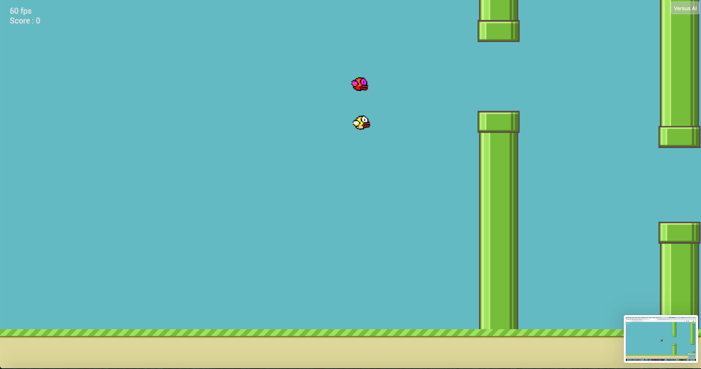

# Flappy Bird AI

### Une démo est disponible [ici](https://d0rianb.github.io/FlappyBirdAI/).

Une intelligence artificielle qui apprend à jouer à FlappyBird.
Plusieurs modes sont disponibles :
 - __Auto__   : l'ordinateur apprend à jouer via un algorithme de neuroévolution.
 - __Versus__ : le joueur essaye de battre un ordinateur pré-entrainé.
 - __Manuel__ : Simple copie du jeu original avec moins de fonctionnalitées et plus de bugs.

#### Bugs connus :
 - le jeu est parfois impossible.
 - le texte `60 fps` apparait derrière le jeu.
 - Le jeu n'est pas `responsive` et devient injouable sur les écrans trop petits.

#### Crédits :
L'algorithme de neuroévolution vient de [Xviniette](https://github.com/xviniette/FlappyLearning).
